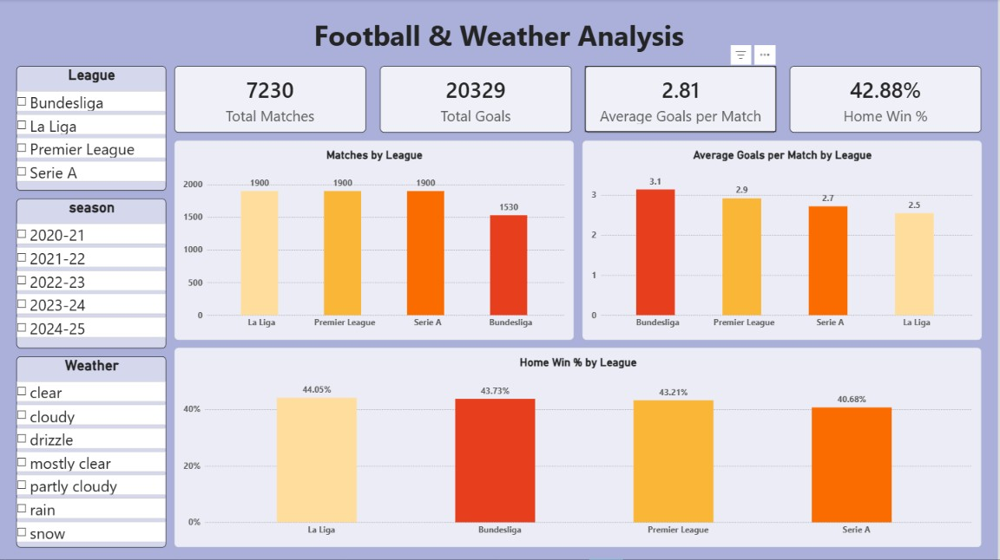
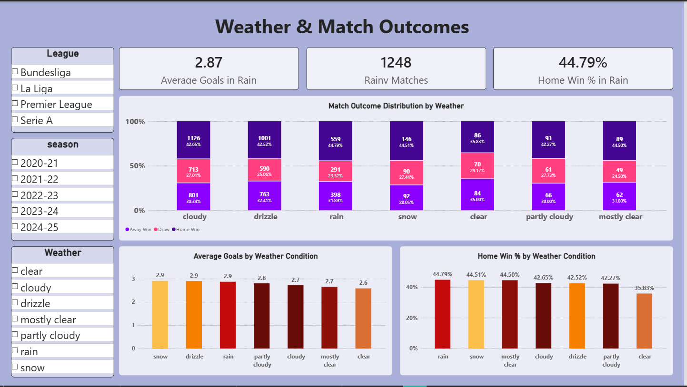
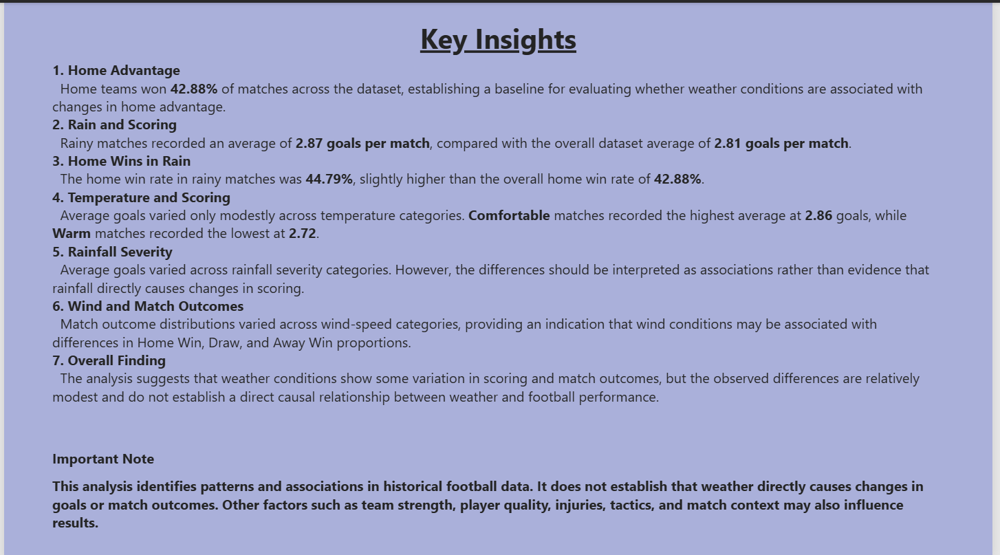

# Football Weather Pipeline

An end-to-end data engineering project that asks: **can weather affect a football match?**

An Apache Airflow (Astronomer) pipeline collects match results and historical weather for four European leagues, joins them, and loads them into PostgreSQL. The results are explored in a Power BI dashboard.

## Dashboard

[View the live dashboard](https://app.powerbi.com/view?r=eyJrIjoiY2Y0YmQ4ZjgtMGU4Zi00YWYzLThmYTEtNjg5ODljOWVmZTRhIiwidCI6ImM2ZTU0OWIzLTVmNDUtNDAzMi1hYWU5LWQ0MjQ0ZGM1YjJjNCJ9&pageName=05a7762eccbf43334fdc)






The Power BI file is `dashboard/visual.pbix`. It reads the `football_weather` table.

## Data

| Source | Used for |
|---|---|
| [openfootball/football.json](https://github.com/openfootball/football.json) | Match results: Premier League, La Liga, Serie A, Bundesliga, seasons 2020-21 to 2024-25 |
| [Open-Meteo Geocoding API](https://open-meteo.com/en/docs/geocoding-api) | City coordinates for each home team |
| [Open-Meteo Historical Weather API](https://open-meteo.com/en/docs/historical-weather-api) | Daily weather for each home city |

Weather variables: weather code, max/min temperature, precipitation, rain, snowfall, precipitation hours, max wind speed, max wind gusts.

## Pipeline

```
extract_matches -> extract_geocoding -> extract_weather -> transform -> load
```

1. **extract_matches**: downloads season JSON files from openfootball (skips files already downloaded)
2. **extract_geocoding**: maps each team to its home city (`dags/team_city_map.py`) and geocodes the cities
3. **extract_weather**: one archive API call per city for its full date range, filtered to match days
4. **transform**: flattens matches, joins weather by (city, date), adds a readable weather label
5. **load**: creates and fills the `football_weather` table in PostgreSQL (about 7,200 rows)

## Project structure

```
dags/
  football_dag.py          # Airflow DAG (TaskFlow API)
  team_city_map.py         # team -> home city
  football/                # extract_*, transform and load modules
include/football/
  raw/                     # raw match files from openfootball
  geocoding/               # city coordinates
  weather/raw/             # raw daily weather, one file per city
  transformed/             # final joined data (JSON)
dashboard/                 # Power BI report and screenshots
.env.example               # template for database settings
```

The generated data files are included in the repo, so you can browse the real output without running anything. For example, open `include/football/transformed/transformed_data.json`.

## Output table: `football_weather`

| Column | Type | Description |
|---|---|---|
| date | text | Match date |
| team1 / team2 | text | Home / away team |
| city | text | Home team's city |
| home_score / away_score | int | Full-time score (null if not played) |
| league / season | text | e.g. `de.1`, `2020-21` |
| weather_code | int | WMO weather code for the day |
| temperature_2m_max / min | real | Daily max / min temperature (°C) |
| precipitation_sum, rain_sum, snowfall_sum | real | Daily totals (mm / cm) |
| precipitation_hours | real | Hours with precipitation |
| wind_speed_10m_max, wind_gusts_10m_max | float | Daily max wind speed and gusts (km/h) |
| weather_label | text | Readable label, e.g. `rain`, `snow` |

## Run it locally

Requirements: Docker, the [Astro CLI](https://www.astronomer.io/docs/astro/cli/install-cli), and a PostgreSQL database.

1. Start Postgres, for example:
   ```
   docker run -d --name football-postgres -e POSTGRES_PASSWORD=change_me -e POSTGRES_DB=football_weather -p 5432:5432 postgres
   ```
2. Copy `.env.example` to `.env` and set your password.
3. Run `astro dev start`, open http://localhost:8080 and trigger `football_dag`.

Notes:
- `POSTGRES_HOST=host.docker.internal` works on Windows and Mac. On Linux you may need to use your machine's IP address.
- The first weather run can hit Open-Meteo rate limits (HTTP 429). Cities already downloaded are cached, so re-running the task continues where it stopped.

## Limitations

- Weather is **daily**, not at kick-off time, because the match data has no kick-off times.
- Weather is taken at the home team's city, so teams sharing a city share the same weather.
- This shows association, not proof of cause.
- File paths are relative to the Airflow working directory, so run it through `astro dev`.

## Credits

Match data: openfootball (public domain). Weather data: [Open-Meteo.com](https://open-meteo.com/) (CC BY 4.0).
